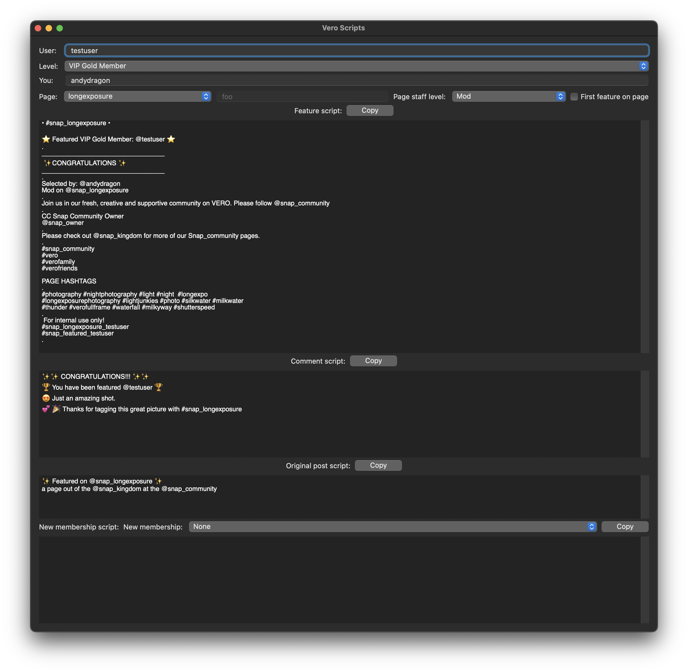

# VERO Moderator Scripts

This application is used to autofill the moderator scripts for snap hub features on VERO. The application allows a moderator or admin to type in the user's alias, their membership level, their own alias and for a particular page (aka snap hub) and have the script generated. These can then be edited (edits are lost if the above information is changed!!) and copied to the clipboard and then posted on VERO.

The scripts are generated from a series of script templates with special markings for placeholders which will be autofilled with the information entered.

Some of the fields are stored in user preferences so when the application is restarted, it remembers the last values entered, the moderator/admin's alias, the page and their page staff level are all saved.



## Template Notes

### Template script locations

The template scripts are located in the 'Script Templates' folder, each template in a separate text file under a folder with the name of the hub. Here is an example of the three base template files:

```
Script Templates/longexposure/feature.template
Script Templates/longexposure/comment.template
Script Templates/longexposure/original post.template
```

These file names are fixed and should not be altered. If the folder for the hub does not have one of the files, the default script template in 'default' will be used.

First your hub provides a slightly different script for the first time a user is featured in your hub, you can provide the different script in a template with the prefix 'first ' prepended to the file name. For example, the snap_foggy hub has a different script for the comment:

```
Script Templates/foggy/first comment.template
```

### Template placeholders

When editing templates, the follow autofill placeholders are available

Placeholder | Description
--- | ---
%%PAGENAME%% | The name of the page (hub) such as 'longexposure' or 'potd'
%%MEMBERLEVEL%% | The member level of the user such as 'Artist', 'Member', 'VIP Gold Member'
%%USERNAME%% | The user's alias such as 'andydragon'
%%YOURNAME%% | Your alias as the person selecting the feature such as 'chefjane'
%%STAFFLEVEL%% | Your staff member level such as 'Mod' or 'Admin'

As well as the autofill placeholders, manual edited placeholders are also available such as '[[LOCATION]]' or '[[SPECIES]]' or '[[USER NAME]]'. These are not filled in but when you copy the script, if there are any remaining manual placeholders, an alert will appear reminding you to fill them in before posting the script.

### Editing the templates

When a team admin edits one of the files, a pull request needs to be created for the change and I (andydragon) will complete the pull request, update the .stringsdict and .xcstrings files and produce a new release for download with the updated templates.

If there are any questions or issues, log an issue in the 'Issues' tab (https://github.com/AndyDragon/VeroScripts/issues) and I will try to get an answer as quickly as possible.

### Example template for the feature post

```
• #snap_%%PAGENAME%% •

⭐️ Featured %%MEMBERLEVEL%%: @%%USERNAME%% ⭐️
.
__________________________________
 ✨CONGRATULATIONS ✨
__________________________________
.
Selected by: @%%YOURNAME%%
%%STAFFLEVEL%% on @snap_%%PAGENAME%%
.
Join us in our fresh, creative and supportive community on VERO. Please follow @snap_community
.
CC Snap Community Owner
@snap_owner
.
Please check out @snap_kingdom for more of our Snap_community pages.
.
#snap_community
#vero
#verofamily
#verofriends

PAGE HASHTAGS
.
#photography #nightphotography #light #night  #longexpo
#longexposurephotography #lightjunkies #photo #silkwater #milkwater
#thunder #verofullframe #waterfall #milkyway #shutterspeed
.
 For internal use only!
#snap_%%PAGENAME%%_%%USERNAME%%
#snap_featured_%%USERNAME%%
.
```